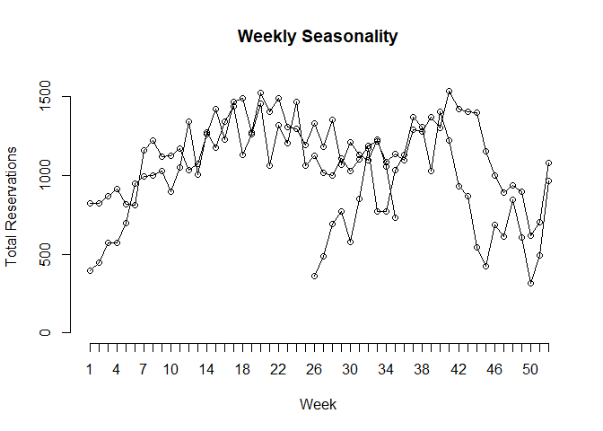
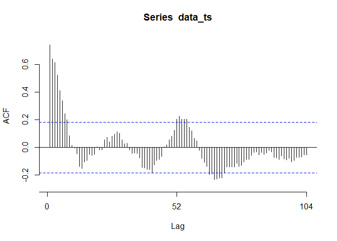
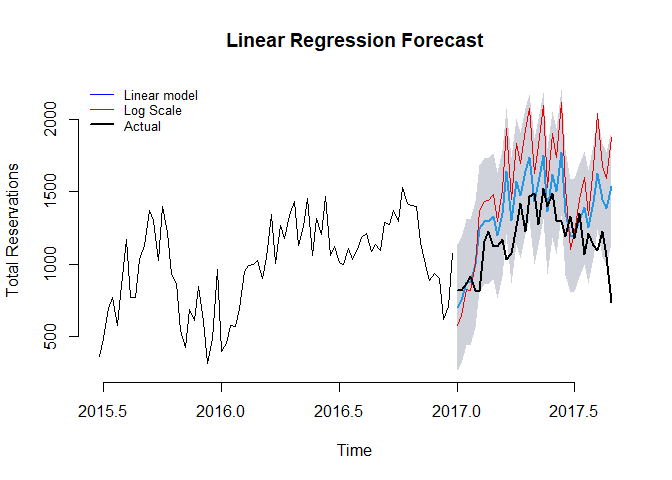
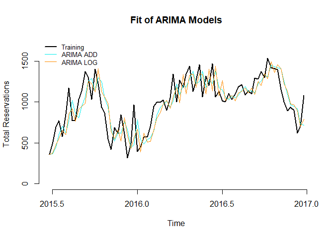
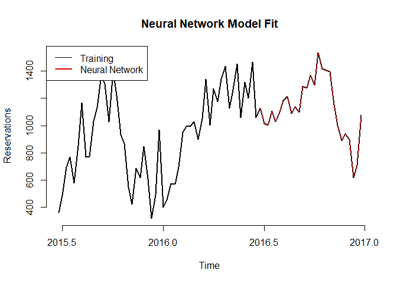
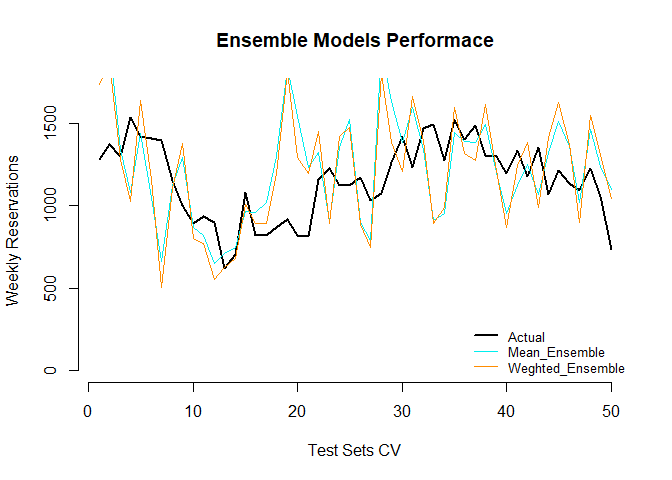
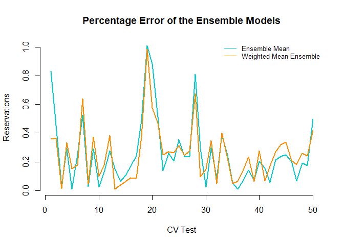

Hotel Time Series Analysis
================
Luis Martinez

# Problem Frame Work

This is a city hotel that counts with 220 rooms(this is a rough
estimate, since the data does not state a specific number of rooms), we
will try to forecast with maximum accuracy using different models for
long term forecasting.

We will not use the traditional Pick Up methods, since the seasonality
is aggregated differently, however this is for forecasting weeks in
advance.

# Overview of the Data

This data was imported from Kaggle under hotel booking.

It is important to note that prior to analysis this data was cleaned
using Python, since this documentation is for modeling we skip that
part, however it will be appended in the repository.

For time series modeling R is most robust with it’s forecast library.

In this document we will explore: 1. Linear Regression (Additive and
Multiplicative) 2. SARIMA (Auto Regression Models and Moving Average) 3.
Dynamic Regression 4. Ensemble Models

    ## Registered S3 method overwritten by 'quantmod':
    ##   method            from
    ##   as.zoo.data.frame zoo

    ## ── Attaching core tidyverse packages ──────────────────────── tidyverse 2.0.0 ──
    ## ✔ dplyr     1.1.4     ✔ readr     2.1.5
    ## ✔ forcats   1.0.0     ✔ stringr   1.5.1
    ## ✔ ggplot2   4.0.0     ✔ tibble    3.3.0
    ## ✔ lubridate 1.9.4     ✔ tidyr     1.3.1
    ## ✔ purrr     1.1.0     
    ## ── Conflicts ────────────────────────────────────────── tidyverse_conflicts() ──
    ## ✖ dplyr::filter() masks stats::filter()
    ## ✖ dplyr::lag()    masks stats::lag()
    ## ℹ Use the conflicted package (<http://conflicted.r-lib.org/>) to force all conflicts to become errors
    ## 
    ## Attaching package: 'zoo'
    ## 
    ## 
    ## The following objects are masked from 'package:base':
    ## 
    ##     as.Date, as.Date.numeric

    ##         Date Reservations
    ## 1 2015-07-01          122
    ## 2 2015-07-02           93
    ## 3 2015-07-03           56
    ## 4 2015-07-04           88
    ## 5 2015-07-05           53
    ## 6 2015-07-06           75

## Data preparation

As we can see we have daily reservations for each day, for this we will
aggregate the results to weekly data so we can compile it and it would
be easier to see the trends.

For this exercise we will se the total reservations we had for a week,
then we can build a more complicated model using days of the week and
months.

``` r
data$Date <- as.Date(data$Date)
weekly_data <- data %>% 
  mutate(WeekStart = floor_date(Date, "week")) %>% 
    group_by(WeekStart) %>% 
      summarise(ReservationsWeek = sum(Reservations),
                .groups = 'drop')

# Extract min year and week day

start_year <- year(min(weekly_data$WeekStart))
start_week <- isoweek(min(weekly_data$WeekStart))

data_ts <- ts(weekly_data$ReservationsWeek, start = c(start_year, start_week), frequency = 52)

capacity <- 220 * 7
```

## First Vizz

Let’s take a first look at how this data looks like and make ourselves
an idea with what we are working.

``` r
plot(
  data_ts,
  main = 'Hotel Weekly Sales',
  xlab = 'Time',
  ylab = 'Reservations',
  bty = 'n',
  col = 'black',
  ylim = c(0, 1600)
)
abline(h = capacity, col = 'red', lty = 2)

legend(
  "bottomright",
  legend = c("Reservations", "Capacity"),
  col = c("black", "red"),
  lty = c(1,2),
  bty = 'n'
)
```

<!-- -->

The first thing that we can observe is a strong volatility of this hotel
reservations through the year.

There seems to be a slight seasonality at the end of the year, as we can
see at the end of the year there seems to be a dip, followed by a spike
for end of year holidays.

Then through the years we can observe that in the mid year is pretty
difficult to observe a pattern but there is a slight increasing trend in
the years.

## Seasonal Overview

``` r
seasonplot(data_ts,
           main = 'Weekly Seasonality',
           xlab = 'Week',
           ylab = 'Total Reservations',
           bty = 'n',
           ylim = c(0,1600))
```

<!-- -->

Now we can observe more clearly that spike in the last weeks going 400
above average, however we can also see the downward spike for the first
weeks of the year, then through the middle of the year it appears to be
very random, and no clear seasonality so far.

## AutoRegression

``` r
Acf(data_ts, bty= 'n')
```

<!-- -->

With this lag autocorrelation graph, we can clearly see a long
dependency in what happened in the weeks before. It also reasures the
seasonality as we can see that there are some spikes that switch from up
to down.

# Modeling

## Linear Regression

First we will not utilize Cross Validation but a simple train and test
split, we will use CV for the best model of each section of the models.

Let’s start with a simple linear regression with seasonal dummy
variables.

``` r
n <- length(data_ts)
n_Valid <- 10
n_Train <- n - n_Valid

train_ts <- window(data_ts, start = c(start_year, start_week), end = c(start_year, n_Train))
valid_ts <- window(data_ts, start = c(start_year, n_Train + 1))
```

``` r
model_1 <- tslm(train_ts ~ trend + season)
summary(model_1)
```

    ## 
    ## Call:
    ## tslm(formula = train_ts ~ trend + season)
    ## 
    ## Residuals:
    ##    Min     1Q Median     3Q    Max 
    ## -274.7  -15.0    0.0   15.0  274.7 
    ## 
    ## Coefficients:
    ##             Estimate Std. Error t value Pr(>|t|)    
    ## (Intercept) 234.6239   179.2496   1.309 0.202012    
    ## trend         5.7991     0.9283   6.247 1.31e-06 ***
    ## season2      46.2009   250.8198   0.184 0.855286    
    ## season3     164.4017   250.8250   0.655 0.517940    
    ## season4     154.6026   250.8336   0.616 0.543019    
    ## season5     275.8034   250.8456   1.099 0.281629    
    ## season6     523.0043   250.8610   2.085 0.047047 *  
    ## season7     561.2051   250.8799   2.237 0.034082 *  
    ## season8     558.4060   250.9023   2.226 0.034925 *  
    ## season9     583.6068   250.9280   2.326 0.028097 *  
    ## season10    449.8077   250.9572   1.792 0.084719 .  
    ## season11    595.0085   250.9898   2.371 0.025454 *  
    ## season12    880.2094   251.0259   3.506 0.001669 ** 
    ## season13    536.4103   251.0653   2.137 0.042215 *  
    ## season14    797.6111   251.1082   3.176 0.003820 ** 
    ## season15    697.8120   251.1545   2.778 0.010007 *  
    ## season16    855.0128   251.2043   3.404 0.002165 ** 
    ## season17    947.2137   251.2575   3.770 0.000849 ***
    ## season18    633.4145   251.3140   2.520 0.018196 *  
    ## season19    761.6154   251.3740   3.030 0.005474 ** 
    ## season20    944.8162   251.4374   3.758 0.000877 ***
    ## season21    547.0171   251.5043   2.175 0.038915 *  
    ## season22    798.2179   251.5745   3.173 0.003853 ** 
    ## season23    678.4188   251.6481   2.696 0.012146 *  
    ## season24    937.6197   251.7251   3.725 0.000954 ***
    ## season25    522.8205   251.8056   2.076 0.047892 *  
    ## season26    351.2991   217.2168   1.617 0.117889    
    ## season27    352.5000   217.2148   1.623 0.116693    
    ## season28    444.2009   217.2168   2.045 0.051104 .  
    ## season29    529.4017   217.2228   2.437 0.021954 *  
    ## season30    390.1026   217.2327   1.796 0.084161 .  
    ## season31    555.3034   217.2466   2.556 0.016775 *  
    ## season32    750.5043   217.2644   3.454 0.001904 ** 
    ## season33    560.7051   217.2862   2.580 0.015864 *  
    ## season34    492.4060   217.3120   2.266 0.032016 *  
    ## season35    640.1068   217.3417   2.945 0.006721 ** 
    ## season36    665.3077   217.3754   3.061 0.005077 ** 
    ## season37    875.5085   217.4131   4.027 0.000436 ***
    ## season38    829.7094   217.4547   3.816 0.000755 ***
    ## season39    731.9103   217.5003   3.365 0.002385 ** 
    ## season40    877.1111   217.5498   4.032 0.000430 ***
    ## season41    899.8120   217.6033   4.135 0.000328 ***
    ## season42    692.0128   217.6607   3.179 0.003792 ** 
    ## season43    646.2137   217.7220   2.968 0.006359 ** 
    ## season44    474.9145   217.7873   2.181 0.038450 *  
    ## season45    285.6154   217.8565   1.311 0.201311    
    ## season46    335.3162   217.9297   1.539 0.135974    
    ## season47    239.0171   218.0068   1.096 0.282966    
    ## season48    372.2179   218.0878   1.707 0.099789 .  
    ## season49    227.9188   218.1727   1.045 0.305791    
    ## season50    -63.8803   218.2616  -0.293 0.772091    
    ## season51     61.3205   218.3543   0.281 0.781063    
    ## season52    479.5214   218.4510   2.195 0.037282 *  
    ## ---
    ## Signif. codes:  0 '***' 0.001 '**' 0.01 '*' 0.05 '.' 0.1 ' ' 1
    ## 
    ## Residual standard error: 177.4 on 26 degrees of freedom
    ## Multiple R-squared:  0.8876, Adjusted R-squared:  0.6628 
    ## F-statistic: 3.948 on 52 and 26 DF,  p-value: 0.0001612

We can see that our model explains fairly well with a R-squared of
0.9353 and for being a baseline it is a great start!

What if we use a fourier series to find seasonality instead of dummy
variables.

``` r
model_2 <- tslm(train_ts ~ trend + season, lambda = 0)
summary(model_2)
```

    ## 
    ## Call:
    ## tslm(formula = train_ts ~ trend + season, lambda = 0)
    ## 
    ## Residuals:
    ##      Min       1Q   Median       3Q      Max 
    ## -0.38783 -0.02005  0.00000  0.02005  0.38783 
    ## 
    ## Coefficients:
    ##              Estimate Std. Error t value Pr(>|t|)    
    ## (Intercept)  5.786082   0.230464  25.106  < 2e-16 ***
    ## trend        0.007066   0.001193   5.921 3.02e-06 ***
    ## season2      0.116020   0.322483   0.360 0.721923    
    ## season3      0.352817   0.322489   1.094 0.283969    
    ## season4      0.338745   0.322500   1.050 0.303213    
    ## season5      0.533148   0.322516   1.653 0.110338    
    ## season6      0.836141   0.322536   2.592 0.015437 *  
    ## season7      0.874397   0.322560   2.711 0.011731 *  
    ## season8      0.870347   0.322589   2.698 0.012087 *  
    ## season9      0.893931   0.322622   2.771 0.010188 *  
    ## season10     0.753751   0.322659   2.336 0.027471 *  
    ## season11     0.901947   0.322701   2.795 0.009623 ** 
    ## season12     1.139506   0.322748   3.531 0.001569 ** 
    ## season13     0.842020   0.322798   2.608 0.014875 *  
    ## season14     1.070975   0.322854   3.317 0.002690 ** 
    ## season15     0.987011   0.322913   3.057 0.005128 ** 
    ## season16     1.109748   0.322977   3.436 0.001995 ** 
    ## season17     1.173317   0.323045   3.632 0.001211 ** 
    ## season18     0.925025   0.323118   2.863 0.008190 ** 
    ## season19     1.030117   0.323195   3.187 0.003718 ** 
    ## season20     1.162502   0.323277   3.596 0.001328 ** 
    ## season21     0.840763   0.323363   2.600 0.015167 *  
    ## season22     1.050784   0.323453   3.249 0.003193 ** 
    ## season23     0.953180   0.323548   2.946 0.006707 ** 
    ## season24     1.145196   0.323647   3.538 0.001538 ** 
    ## season25     0.811554   0.323750   2.507 0.018769 *  
    ## season26     0.478005   0.279279   1.712 0.098882 .  
    ## season27     0.568967   0.279276   2.037 0.051919 .  
    ## season28     0.733890   0.279279   2.628 0.014227 *  
    ## season29     0.829379   0.279287   2.970 0.006335 ** 
    ## season30     0.644173   0.279299   2.306 0.029316 *  
    ## season31     0.862670   0.279317   3.088 0.004743 ** 
    ## season32     1.051006   0.279340   3.762 0.000866 ***
    ## season33     0.848111   0.279368   3.036 0.005394 ** 
    ## season34     0.787328   0.279401   2.818 0.009114 ** 
    ## season35     0.946310   0.279440   3.386 0.002261 ** 
    ## season36     0.968505   0.279483   3.465 0.001852 ** 
    ## season37     1.138248   0.279531   4.072 0.000387 ***
    ## season38     1.101065   0.279585   3.938 0.000549 ***
    ## season39     1.009872   0.279643   3.611 0.001277 ** 
    ## season40     1.130963   0.279707   4.043 0.000417 ***
    ## season41     1.139075   0.279776   4.071 0.000388 ***
    ## season42     0.957943   0.279850   3.423 0.002061 ** 
    ## season43     0.909198   0.279928   3.248 0.003198 ** 
    ## season44     0.667014   0.280012   2.382 0.024818 *  
    ## season45     0.435249   0.280101   1.554 0.132298    
    ## season46     0.600162   0.280195   2.142 0.041737 *  
    ## season47     0.480347   0.280295   1.714 0.098480 .  
    ## season48     0.658683   0.280399   2.349 0.026694 *  
    ## season49     0.464956   0.280508   1.658 0.109427    
    ## season50    -0.056929   0.280622  -0.203 0.840818    
    ## season51     0.222776   0.280741   0.794 0.434654    
    ## season52     0.766957   0.280866   2.731 0.011197 *  
    ## ---
    ## Signif. codes:  0 '***' 0.001 '**' 0.01 '*' 0.05 '.' 0.1 ' ' 1
    ## 
    ## Residual standard error: 0.228 on 26 degrees of freedom
    ## Multiple R-squared:  0.8705, Adjusted R-squared:  0.6116 
    ## F-statistic: 3.362 on 52 and 26 DF,  p-value: 0.000654

The problem with this model is that it is very hard to interpret the
results as for how the seasonality works, but we can plot both models
out and see how they fit.

``` r
plot(
  train_ts,
  main = "Fit of Linear Regression Models",
  xlab = "Time",
  ylab = "Total Reservations",
  bty = 'n',
  ylim = range(c(train_ts, model_1$fitted.values, model_2$fitted.values)),
  col = 'black',
  lwd = 2
)
lines(model_1$fitted.values, col = 'cyan2')
lines(model_2$fitted.values, col = 'darkorange')
legend(
  'topleft',
  legend = c("Training", "Additive Model", "Log-Scale Model"),
  col = c("black", "cyan2", "darkorange"),
  lwd = c(2,1,1),
  bty = 'n',
  cex = 0.8
)
```

<!-- -->

We can clearly see that the red line closely resembles the training data
with the values in the middle being exactly the same! IN the
multiplicative we can see that both have the same results, just that on
the peaks the multiplicative tends to overestimate or underestimate,
being a more aggressive model.

Now lets see how they perform on unseen data.

``` r
model_1_pred <- forecast(model_1, h = 35, level = 90)
model_2_pred <- forecast(model_2, h = 35, level = 90)
```

**Accuracy for Additive Model**

``` r
accuracy(model_1_pred$mean, valid_ts)
```

    ##                 ME     RMSE      MAE       MPE     MAPE      ACF1 Theil's U
    ## Test set -192.2778 286.5539 222.3381 -17.97278 20.78928 0.1787244  1.847859

**Accuracy for Log-Scale Model**

``` r
accuracy(model_2_pred$mean, valid_ts)
```

    ##                 ME     RMSE      MAE       MPE     MAPE      ACF1 Theil's U
    ## Test set -359.9621 485.9021 404.7033 -31.85483 36.61372 0.3196445  3.040358

We can see that our model is constantly over estimating the forecast,
and lacks to capture the downward trend that the whole time series
shows, let’s plot it to be able to see it better.

``` r
plot(model_1_pred,
     main = "Linear Regression Forecast",
     xlab = 'Time',
     ylab = 'Total Reservations',
     bty = 'n',
)
lines(
  model_2_pred$mean, col = "red2"
)
lines(
  valid_ts, col = 'black', lwd = 2
)
legend(
  "topleft",
  legend = c("Linear model", 'Log Scale', 'Actual'),
  col = c('blue', 'red2', 'black'),
  lwd = c(1,1,2),
  bty = 'n',
  cex = 0.8
)
```

<!-- -->

Overall the model is not great, we overestimate. We are still over the
limit of the confidence level however, this problem begs another model
more complicated that this one,

## ARIMA and SARIMA MODEL

Let’s first explore how SARIMA models function.

They use differentiation to take non-stationary time series into
stationary and then find the number of lags of trend and shock (error)
to correlate and average respectively.

We can first try using what the R package suggests also by doing both
the additive forecast and the multiplicative in the log-scale.

**Let’s Use R’s suggestion**

``` r
model_3 <- auto.arima(train_ts) #Additive
model_4 <- auto.arima(train_ts, lambda = 0)
```

**This is the additive model output**

    ## Series: train_ts 
    ## ARIMA(0,1,1) 
    ## 
    ## Coefficients:
    ##           ma1
    ##       -0.3759
    ## s.e.   0.1051
    ## 
    ## sigma^2 = 39919:  log likelihood = -523.44
    ## AIC=1050.88   AICc=1051.04   BIC=1055.59

We can see that we take one difference and then only use the last error
shock term to perform the moving average by the coefficient.

**THis is the multiplicative model output**

``` r
model_4
```

    ## Series: train_ts 
    ## ARIMA(2,1,0) 
    ## Box Cox transformation: lambda= 0 
    ## 
    ## Coefficients:
    ##           ar1      ar2
    ##       -0.2889  -0.3975
    ## s.e.   0.1078   0.1078
    ## 
    ## sigma^2 = 0.0553:  log likelihood = 3.05
    ## AIC=-0.1   AICc=0.22   BIC=6.97

In this model we do take one difference and we use the last two lags to
auto regress the forecast. This means that this week’s sales depends on
the past two, mostly negatively.

Let’s see graphically how it fits.

``` r
plot(
  train_ts,
  main = "Fit of ARIMA Models",
  xlab = "Time",
  ylab = "Total Reservations",
  bty = 'n',
  ylim = c(0, 1700),
  col = 'black',
  lwd = 2
)
lines(model_3$fitted, col = 'cyan2')
lines(model_4$fitted, col = 'darkorange')
legend(
  'topleft',
  legend = c("Training", "ARIMA ADD", "ARIMA LOG"),
  col = c("black", "cyan2", "darkorange"),
  lwd = c(2,1,1),
  bty = 'n',
  cex = 0.8
)
```

<!-- -->

We can see that both lines tend to capture the signal very well of the
model but it has a very hard time to understand the peak that it
experiences in the last two weeks of the year. Let’s see how the
forecast of this models perform.

``` r
model_3_pred <- forecast(model_3, h = 35, level = 90)
model_4_pred <- forecast(model_3_pred, h = 35, level = 90)
```

**The ARMA (Additive) model**

    ##                    ME     RMSE      MAE       MPE     MAPE      MASE       ACF1
    ## Training set  11.5174 197.2514 160.2473 -2.369406 18.99353 0.5011207 0.01191517
    ## Test set     221.7384 306.0569 267.2944 16.022192 21.71205 0.8358756 0.63644728
    ##              Theil's U
    ## Training set        NA
    ## Test set      1.772415

**The ARMA (Multiplicative Model)**

    ##                    ME     RMSE      MAE       MPE     MAPE      MASE       ACF1
    ## Training set  11.5174 197.2514 160.2473 -2.369406 18.99353 0.5011207 0.01191517
    ## Test set     221.7384 306.0569 267.2944 16.022192 21.71205 0.8358756 0.63644728
    ##              Theil's U
    ## Training set        NA
    ## Test set      1.772415

The first thing that pops to mind is that this model is constantly
underestimating the validation set, we can see that because the ME is
positive, different from the regression models. The percentage error is
still in the 20’s% and in the regression model it was 20’s for additive
and 30’s for multiplicative.

However if we look at the values of the prediction:

``` r
head(model_3_pred$mean)
```

    ## Time Series:
    ## Start = c(2017, 1) 
    ## End = c(2017, 6) 
    ## Frequency = 52 
    ## [1] 940.7474 940.7474 940.7474 940.7474 940.7474 940.7474

We can see that all values are the same, this is a clear signal of a
random walk behavior! Meaning that our model just stays on the mean as
its best guess and this happens with the multiplicative as well.

This kind of time series models are very hard to forecast, another
example of random walks are stocks!

For this reason we might want to use a more robust model.

## DYNAMIC REGRESSION

This is one of the most famous forecasting models for time series data,
used by many government agencies and statistics departments. It used two
of the models we have already used: regression and SARIMA.

This will use the trend and level as a regression model but the error as
a autoregressive model.

Let’s model it!

``` r
xreg <- cbind(trend = seq_along(train_ts), seasonaldummy(train_ts))
model_5 <- auto.arima(train_ts, xreg = xreg)
model_5
```

    ## Series: train_ts 
    ## Regression with ARIMA(1,0,0) errors 
    ## 
    ## Coefficients:
    ##          ar1  intercept  trend         S1         S2         S3         S4
    ##       0.5776   701.2720  6.042  -532.1288  -461.3845  -329.1116  -330.8864
    ## s.e.  0.1014    91.7049  1.016    92.2854   112.2090   120.8648   125.0895
    ##              S5        S6        S7        S8        S9       S10       S11
    ##       -205.1537   44.5624   84.1137   81.9919  107.4807  -26.3499  118.7534
    ## s.e.   127.2681  128.4109  128.9984  129.2784  129.3860  129.3975  129.3567
    ##            S12       S13       S14       S15       S16       S17       S18
    ##       403.7859   59.7539  320.6443  220.4193  377.0074  468.2822  153.0418
    ## s.e.  129.2887  129.2086  129.1252  129.0444  128.9712  128.9124  128.8794
    ##            S19       S20       S21       S22       S23       S24       S25
    ##       278.9365  458.3432   54.1646  294.4951  156.0372  383.0835  -87.2221
    ## s.e.  128.8944  128.9952  129.2327  129.6228  129.9485  129.1771  124.1643
    ##             S26        S27       S28       S29       S30       S31       S32
    ##       -121.9116  -120.9372  -29.4566   55.5039  -84.0529   80.8875  275.8339
    ## s.e.   108.2498   108.0064  107.7719  107.5465  107.3302  107.1229  106.9249
    ##            S33       S34       S35       S36       S37       S38       S39
    ##        85.7917   17.2613  164.7333  189.6975  399.6470  353.5858  255.5194
    ## s.e.  106.7358  106.5556  106.3840  106.2203  106.0637  105.9124  105.7631
    ##            S40       S41       S42       S43       S44        S45        S46
    ##       400.4543  422.8974  214.8606  168.8950   -2.6577  -192.2046  -142.7487
    ## s.e.  105.6107  105.4455  105.2513  104.9995  104.6407   104.0881   103.1892
    ##             S47        S48        S49        S50        S51
    ##       -239.2916  -106.3342  -250.8765  -542.9184  -417.9596
    ## s.e.   101.6728    99.0450    94.3696    85.7172    68.2326
    ## 
    ## sigma^2 = 23205:  log likelihood = -463.91
    ## AIC=1037.82   AICc=1305.65   BIC=1168.14

We can clearly observe in this model that the error terms have a
correlation term but no difference. Let’s take a look at the
multiplicative with a log scale.

``` r
model_6 <- auto.arima(train_ts, xreg= xreg, lambda = 0)
model_6
```

    ## Series: train_ts 
    ## Regression with ARIMA(1,0,0) errors 
    ## Box Cox transformation: lambda= 0 
    ## 
    ## Coefficients:
    ##          ar1  intercept   trend       S1       S2       S3       S4       S5
    ##       0.6250     6.5241  0.0076  -0.8430  -0.6939  -0.4366  -0.4381  -0.2360
    ## s.e.  0.1058     0.1253  0.0015   0.1167   0.1443   0.1572   0.1640   0.1677
    ##           S6      S7      S8     S9      S10     S11     S12     S13     S14
    ##       0.0716  0.1124  0.1097  0.134  -0.0060  0.1420  0.3792  0.0810  0.3091
    ## s.e.  0.1698  0.1710  0.1717  0.172   0.1722  0.1722  0.1721  0.1721  0.1720
    ##          S15     S16     S17     S18     S19     S20     S21     S22     S23
    ##       0.2239  0.3448  0.4058  0.1537  0.2531  0.3765  0.0409  0.2290  0.0966
    ## s.e.  0.1719  0.1718  0.1718  0.1719  0.1721  0.1727  0.1736  0.1748  0.1757
    ##          S24      S25      S26      S27      S28     S29      S30     S31
    ##       0.2334  -0.1884  -0.2747  -0.1843  -0.0200  0.0750  -0.1108  0.1072
    ## s.e.  0.1741   0.1655   0.1448   0.1444   0.1441  0.1437   0.1434  0.1431
    ##          S32     S33     S34     S35     S36     S37     S38     S39     S40
    ##       0.2950  0.0915  0.0302  0.1886  0.2103  0.3795  0.3418  0.2500  0.3705
    ## s.e.  0.1428  0.1425  0.1422  0.1419  0.1416  0.1414  0.1411  0.1409  0.1406
    ##          S41     S42     S43      S44      S45      S46      S47      S48
    ##       0.3781  0.1964  0.1471  -0.0956  -0.3279  -0.1635  -0.2839  -0.1061
    ## s.e.  0.1403  0.1399  0.1394   0.1386   0.1375   0.1358   0.1331   0.1288
    ##           S49      S50      S51
    ##       -0.3004  -0.8228  -0.5436
    ## s.e.   0.1216   0.1091   0.0856
    ## 
    ## sigma^2 = 0.03762:  log likelihood = 62.68
    ## AIC=-15.35   AICc=252.47   BIC=114.97

The curious thing about this two models is that the error term for
regression is different, but we do know that we take more than 50% of
our previous error. Let’s see graphically how it fits.

``` r
plot(
  train_ts,
  main = "Fit of Dynamic Regression",
  xlab = "Time",
  ylab = "Total Reservations",
  bty = 'n',
  ylim = c(0, 1700),
  col = 'black',
  lwd = 2
)
lines(model_5$fitted, col = 'cyan2')
lines(model_6$fitted, col = 'darkorange')
legend(
  'topleft',
  legend = c("Training", "ARIMAX ADD", "ARIMAX LOG"),
  col = c("black", "cyan2", "darkorange"),
  lwd = c(2,1,1),
  bty = 'n',
  cex = 0.8
)
```

<!-- -->

These two models seem to fit way better the training data but we still
need to find out how it performs in the forecasting and validation set.

``` r
newxreg <- cbind(trend = (n + 1): (n + 35), seasonaldummy(valid_ts, h=35))
model_5_pred <- forecast(model_5, xreg = newxreg, level = 90)
model_6_pred <- forecast(model_6, xreg = newxreg, level = 90)
```

**Result of additive of dynamic regression model**

``` r
accuracy(model_5_pred, valid_ts)
```

    ##                       ME      RMSE       MAE         MPE      MAPE      MASE
    ## Training set    2.182494  85.69279  62.40087  -0.7420745  6.754319 0.1951382
    ## Test set     -362.801440 574.84440 485.94102 -38.8290921 47.519994 1.5196210
    ##                      ACF1 Theil's U
    ## Training set -0.005782031        NA
    ## Test set      0.792241661   4.06404

**Result of multiplicative dynamic regression model**

``` r
accuracy(model_6_pred, valid_ts)
```

    ##                       ME      RMSE       MAE        MPE      MAPE      MASE
    ## Training set    6.918114  107.4827  79.62005  -0.199364  8.281032 0.2489856
    ## Test set     -768.149152 1067.7879 898.61860 -77.179302 86.427786 2.8101346
    ##                    ACF1 Theil's U
    ## Training set 0.06712499        NA
    ## Test set     0.79631406  7.312796

We see that both our models perform not so greatly in the validation
test, this could be due to two reasons, first one is the lack of the
data, since we only have one year and a half in order to forecast.

This can be seen to the great performance for training the data but
lacking in the test data, this is particularly common for very scarce
data.

## NEURAL NETWORK

We can also create a neural network in order to create a more robust
model.

We will use a small hidden layer and hidden size in order to save
computational power and time.

We will use 2 non seasonal lags and 1 seasonal lag and 5 hidden neurons
in the hidden layer.

``` r
model7 <- nnetar(train_ts, p = 2, P = 1, size = 5, xreg = xreg)

plot(train_ts,
     lwd = 2,
     bty = 'n',
     main = "Neural Network Model Fit",
     xlab = 'Time',
     ylab = 'Reservations')
lines(model7$fitted,
      col = 'red3')
legend('topleft',
       legend = c("Training", "Neural Network"),
       col = c("black", "red3"),
       lwd = c(1,2))
```

<!-- -->

Although the Neural Network fits perfectly, we see that it needs a lot
of data before it can start training, therefore we will not include in
in our ensemble model.

## ENSEMBLE MODELS

Now that we have created 6 different models, we can create one ensemble
model by combining all of our models and try to fit the validation set
as better as wen can.

In the last models we have been using one validation and one training
set, however that has not yielded the best results, therefore we are
going to use Cross Validation, meaning creating multiple training and
validation data sets to find the minimum error our ensemble model will
have.

Since we have 114 weeks we are going to create a training window size of
52 and forecast the next 13 weeks (meaning the next quarter).

First, we need to create the training window and the test, this is for a
sliding cross validation. Here we will use 52 weeks or one year of data
to predit the next quarter

``` r
n <- length(data_ts) 
h <- 13 
w <- 52 


start_pos <- w
end_pos <- n - h


xreg_total_fourier <- cbind(trend = seq_along(data_ts), fourier(data_ts, K=15))
time_total <- time(data_ts)
```

Due to the limited data, since we need at least 3 years to be able to
make good seasonal dummies, we will use fourier series in order to
recreate the seasonality.

``` r
CV_result <- c() ####Create matrix to store the results ###


for(t in start_pos:end_pos){
  print(paste("Iteration:", t))
  

  tmp_train <- window(data_ts, start = time_total[t - w + 1], end = time_total[t])
  tmp_test  <- window(data_ts, start = time_total[t + 1], end = time_total[t + h])
  
  #####Create the fourier series for the ARIMAX models####
  tmp_train_xreg_fourier <- xreg_total_fourier[(t - w + 1):t, , drop = FALSE]
  tmp_test_xreg_fourier  <- xreg_total_fourier[(t + 1):(t + h), , drop = FALSE]
  

  fourier_terms <- fourier(tmp_train, K = 5) #####For Linear Regression###
  tmp_model1 <- tslm(tmp_train ~ trend + fourier_terms)
  tmp_model2 <- tslm(tmp_train ~ trend + fourier_terms, lambda = 0)
  tmp_model3 <- auto.arima(tmp_train)
  tmp_model4 <- auto.arima(tmp_train, lambda = 0)
  tmp_model5 <- auto.arima(tmp_train, xreg = tmp_train_xreg_fourier)
  

  future_fourier <- fourier(tmp_train, K = 5, h = h)
  pred_1 <- forecast(tmp_model1, newdata = data.frame(future_fourier), h = h)
  pred_2 <- forecast(tmp_model2, newdata = data.frame(future_fourier), h = h)
  pred_3 <- forecast(tmp_model3, h = h) 
  pred_4 <- forecast(tmp_model4, h = h)
  pred_5 <- forecast(tmp_model5, xreg = tmp_test_xreg_fourier, h = h)

  

  tmp_cv_result <- c(
    Actual  = tmp_test[h],
    Pred_M1 = pred_1$mean[h],
    Pred_M2 = pred_2$mean[h],
    Pred_M3 = pred_3$mean[h],
    Pred_M4 = pred_4$mean[h],
    Pred_M5 = pred_5$mean[h]
  )
  
  CV_result <- rbind(CV_result, tmp_cv_result)
}

# Add descriptive column names
colnames(CV_result) <- c("Actual", "Pred_TSLM_Fourier", "Pred_TSLM_Fourier_Log", 
                         "Pred_ARIMA", "Pred_ARIMA_Log", "Pred_ARIMAX_Full")

# Final result table
CV_result
```

After more than 100 iterations we can see how the actual and the
different models vs the actual. Here are the results of all the models
with the actuals.

    ##                  Actual Pred_TSLM_Fourier Pred_TSLM_Fourier_Log Pred_ARIMA
    ## tmp_cv_result      1277         2296.0164             5298.5503  1191.5367
    ## tmp_cv_result.1    1369         1981.7578             3185.9194  1156.9580
    ## tmp_cv_result.2    1298         1522.4244             1770.1949  1078.7933
    ## tmp_cv_result.3    1534         1230.5402             1291.8283  1035.7479
    ## tmp_cv_result.4    1420         1158.3640             1198.4500  1074.4041
    ## tmp_cv_result.5    1406          780.8229              733.0914  1050.4772
    ## tmp_cv_result.6    1396          766.2776              718.3879  1082.4283
    ## tmp_cv_result.7    1153         1242.1346             1157.5547  1141.1600
    ## tmp_cv_result.8    1001         1252.0898             1152.4020  1182.2514
    ## tmp_cv_result.9     890          892.3488              801.6669  1128.9992
    ## tmp_cv_result.10    937          662.3223              644.0196  1132.7981
    ## tmp_cv_result.11    898          362.7004              476.6747  1113.0808
    ## tmp_cv_result.12    618          476.8184              484.8485  1208.3512
    ## tmp_cv_result.13    705          504.0492              463.2312  1245.0491
    ## tmp_cv_result.14   1077          324.9912              379.9567  1402.0989
    ## tmp_cv_result.15    820          580.6651              480.6118  1646.8436
    ## tmp_cv_result.16    821         1131.2878              839.7583  1592.2947
    ## tmp_cv_result.17    870         1386.8852             1259.1647  1623.5506
    ## tmp_cv_result.18    914         1683.1984             2078.9205  1657.2024
    ## tmp_cv_result.19    818         1671.2865             2175.9669  1652.4141
    ## tmp_cv_result.20    812         1248.6399             1267.0344  1289.5243
    ## tmp_cv_result.21   1160         1057.9997             1111.9884  1148.7508
    ## tmp_cv_result.22   1223          880.3287              943.3408   908.3167
    ## tmp_cv_result.23   1121         1234.7078             1584.7227   922.7420
    ## tmp_cv_result.24   1122         1456.8297             2272.9344   900.7794
    ## tmp_cv_result.25   1171         1098.6509             1110.7014   729.7706
    ## tmp_cv_result.26   1033         1039.5969             1013.7742   678.7366
    ## tmp_cv_result.27   1075         1930.2939             3369.0972   949.4099
    ## tmp_cv_result.28   1261         1850.3810             2944.9906  1050.0448
    ## tmp_cv_result.29   1419         1673.6007             2287.8340  1005.2572
    ## tmp_cv_result.30   1229         1552.2144             1987.0336  1006.7943
    ## tmp_cv_result.31   1466         1343.6992             1473.3940  1060.6875
    ## tmp_cv_result.32   1489         1065.5367             1026.1632   849.9351
    ## tmp_cv_result.33   1273         1055.1988              979.5700   829.3701
    ## tmp_cv_result.34   1522         1440.9454             1420.1367  1005.9542
    ## tmp_cv_result.35   1402         1724.3180             1872.4044  1132.5456
    ## tmp_cv_result.36   1486         1740.0061             1958.9318  1126.2836
    ## tmp_cv_result.37   1304         1434.4284             1496.0849  1121.6879
    ## tmp_cv_result.38   1295         1182.8922             1212.7252  1156.4363
    ## tmp_cv_result.39   1195         1098.7783             1111.1767  1071.3779
    ## tmp_cv_result.40   1332          753.8126              812.9702  1078.0162
    ## tmp_cv_result.41   1179          897.4457              911.6705  1184.6767
    ## tmp_cv_result.42   1354         1055.9297             1031.6825  1330.6581
    ## tmp_cv_result.43   1069         1118.9453             1101.3665  1279.3953
    ## tmp_cv_result.44   1211         1534.0606             1532.7657  1157.9519
    ## tmp_cv_result.45   1132         1497.9089             1499.1658  1188.6119
    ## tmp_cv_result.46   1094         1238.6387             1255.5830  1159.4082
    ## tmp_cv_result.47   1227         1459.5043             1481.8260  1186.1481
    ## tmp_cv_result.48   1055         1098.7632             1104.6857  1168.7188
    ## tmp_cv_result.49    733         1129.4346             1122.5538  1246.0973
    ##                  Pred_ARIMA_Log Pred_ARIMAX_Full
    ## tmp_cv_result         1157.8315        1745.4764
    ## tmp_cv_result.1       1185.8353        2446.2855
    ## tmp_cv_result.2       1077.1248        1237.7895
    ## tmp_cv_result.3       1035.8290         807.0443
    ## tmp_cv_result.4       1062.7344        2684.6003
    ## tmp_cv_result.5       1049.8885        1642.1154
    ## tmp_cv_result.6       1075.7362        -331.2058
    ## tmp_cv_result.7       1136.8890         927.6503
    ## tmp_cv_result.8       1178.2345        1691.8424
    ## tmp_cv_result.9       1127.6390         385.9876
    ## tmp_cv_result.10      1132.0807         520.5201
    ## tmp_cv_result.11      1113.0523         189.1228
    ## tmp_cv_result.12      1203.7529         191.2144
    ## tmp_cv_result.13      1241.4051         289.4839
    ## tmp_cv_result.14      1312.9748        1390.6672
    ## tmp_cv_result.15      1284.7756         810.9072
    ## tmp_cv_result.16      1431.1064         105.4529
    ## tmp_cv_result.17      1414.7176         790.0024
    ## tmp_cv_result.18      1861.2494        1897.5574
    ## tmp_cv_result.19      1435.0016         761.5484
    ## tmp_cv_result.20      1285.8149        1047.4035
    ## tmp_cv_result.21      1149.0508        2138.3446
    ## tmp_cv_result.22       933.6519         859.4528
    ## tmp_cv_result.23       923.3280        2092.7161
    ## tmp_cv_result.24       898.9665        2065.0020
    ## tmp_cv_result.25       687.9390         862.1555
    ## tmp_cv_result.26       680.3675         520.6340
    ## tmp_cv_result.27      1077.0000        2398.8157
    ## tmp_cv_result.28       871.4555        1421.2451
    ## tmp_cv_result.29       936.0527        1011.8576
    ## tmp_cv_result.30      1032.6522        2390.4852
    ## tmp_cv_result.31      1034.9763        1797.0205
    ## tmp_cv_result.32       848.5425         762.4271
    ## tmp_cv_result.33       828.5403        1083.8503
    ## tmp_cv_result.34       990.4939        2357.9692
    ## tmp_cv_result.35      1122.0788        1097.7600
    ## tmp_cv_result.36      1122.4179         948.4068
    ## tmp_cv_result.37      1120.9342        2279.0136
    ## tmp_cv_result.38      1150.7158        1308.4343
    ## tmp_cv_result.39      1079.6015         415.2141
    ## tmp_cv_result.40      1076.9874        1896.4030
    ## tmp_cv_result.41      1181.6849        2058.8922
    ## tmp_cv_result.42      1324.2230         583.5022
    ## tmp_cv_result.43      1264.5354        1847.8177
    ## tmp_cv_result.44      1123.0221        2206.9671
    ## tmp_cv_result.45      1148.6577        1464.0316
    ## tmp_cv_result.46      1136.0176         317.1153
    ## tmp_cv_result.47      1168.0560        2006.1286
    ## tmp_cv_result.48      1146.6753        1678.4580
    ## tmp_cv_result.49      1228.9366         761.7540

In the ensemble model we can do it two ways, via mean and via a weighted
mean as the best model from all the models. We will apply both.

**ENSEMBLE WITH MEAN**

``` r
ensemnle_mean <- apply(CV_result[,c(2:6)], 1, mean)
CV_result <- cbind(CV_result, ensemnle_mean)
colnames(CV_result)[ncol(CV_result)] <- "Ensemble_Mean"
```

**ENSEMBLE WITH WEIGHTED MEAN VIA NNLS**

``` r
library(nnls)
nnls_result <- nnls(A=CV_result[,2:6], b=CV_result[,1])
colnames(CV_result)[which(coef(nnls_result)>0.05)+1]
nnls_selected_model <- which(coef(nnls_result)>0.05)+1

ensemble_nnls <- apply(CV_result[,nnls_selected_model], 1, mean)

CV_result <- cbind(CV_result, ensemble_nnls)
colnames(CV_result)[ncol(CV_result)] <- "Ensemble_Mean_WeightedMean"
```

Lets take a look at the result of both ensemble models

    ##                  Actual Ensemble_Mean Ensemble_Mean_WeightedMean
    ## tmp_cv_result      1277     2337.8823                  1733.1081
    ## tmp_cv_result.1    1369     1991.3512                  1871.2929
    ## tmp_cv_result.2    1298     1337.2654                  1279.1129
    ## tmp_cv_result.3    1534     1080.1980                  1024.4712
    ## tmp_cv_result.4    1420     1435.7105                  1635.2329
    ## tmp_cv_result.5    1406     1051.2791                  1157.6089
    ## tmp_cv_result.6    1396      662.3248                   503.6027
    ## tmp_cv_result.7    1153     1121.0777                  1102.2246
    ## tmp_cv_result.8    1001     1291.3640                  1374.0556
    ## tmp_cv_result.9     890      867.3283                   801.9918
    ## tmp_cv_result.10    937      818.3481                   771.6410
    ## tmp_cv_result.11    898      650.9262                   554.9585
    ## tmp_cv_result.12    618      712.9971                   623.9285
    ## tmp_cv_result.13    705      748.6437                   678.3127
    ## tmp_cv_result.14   1077      962.1378                  1009.5444
    ## tmp_cv_result.15    820      960.7607                   892.1159
    ## tmp_cv_result.16    821     1019.9800                   889.2824
    ## tmp_cv_result.17    870     1294.8641                  1197.2018
    ## tmp_cv_result.18    914     1835.6256                  1814.0017
    ## tmp_cv_result.19    818     1539.2435                  1289.2788
    ## tmp_cv_result.20    812     1227.6834                  1193.9528
    ## tmp_cv_result.21   1160     1321.2268                  1448.4650
    ## tmp_cv_result.22   1223      905.0182                   891.1445
    ## tmp_cv_result.23   1121     1351.6433                  1416.9173
    ## tmp_cv_result.24   1122     1518.9024                  1473.5994
    ## tmp_cv_result.25   1171      897.8435                   882.9151
    ## tmp_cv_result.26   1033      786.6219                   746.8662
    ## tmp_cv_result.27   1075     1944.9234                  1802.0365
    ## tmp_cv_result.28   1261     1627.6234                  1381.0272
    ## tmp_cv_result.29   1419     1382.9204                  1207.1703
    ## tmp_cv_result.30   1229     1593.8359                  1658.4506
    ## tmp_cv_result.31   1466     1341.9555                  1391.8987
    ## tmp_cv_result.32   1489      910.5209                   892.1688
    ## tmp_cv_result.33   1273      955.3059                   989.1965
    ## tmp_cv_result.34   1522     1443.0999                  1596.4695
    ## tmp_cv_result.35   1402     1389.8214                  1314.7189
    ## tmp_cv_result.36   1486     1379.2092                  1270.2769
    ## tmp_cv_result.37   1304     1490.4298                  1611.4587
    ## tmp_cv_result.38   1295     1202.2408                  1214.0141
    ## tmp_cv_result.39   1195      955.2297                   864.5313
    ## tmp_cv_result.40   1332     1123.6379                  1242.4010
    ## tmp_cv_result.41   1179     1246.8740                  1379.3410
    ## tmp_cv_result.42   1354     1065.1991                   987.8850
    ## tmp_cv_result.43   1069     1322.4120                  1410.4328
    ## tmp_cv_result.44   1211     1510.9535                  1621.3499
    ## tmp_cv_result.45   1132     1359.6752                  1370.1994
    ## tmp_cv_result.46   1094     1021.3526                   897.2572
    ## tmp_cv_result.47   1227     1460.3326                  1544.5630
    ## tmp_cv_result.48   1055     1239.4602                  1307.9655
    ## tmp_cv_result.49    733     1097.7552                  1040.0417

We can see that precision wise, the ensemble models do a great job at
capturing the signal, even without the necessary data to create better
results.

Let’s see the accuracy of the models.

**Accuracy Mean Ensemble Model**

    ##                 ME     RMSE      MAE      MPE     MAPE
    ## Test set -82.54032 373.7533 285.3965 -10.0503 25.87401

**Accuracy NNL Weighted Mean**

    ##                 ME     RMSE      MAE       MPE     MAPE
    ## Test set -51.71364 349.1444 285.7171 -6.755188 25.34109

Given the data the most accurate model is the Weighted Mean for a little
percentage, overestimating the predictions.

Let’s see how they fit in the graph.

``` r
time_span <- 0:50
plot(
  CV_result[time_span,1],
  main = "Ensemble Models Performace",
  xlab = 'Test Sets CV',
  ylab = 'Weekly Reservations',
  type = 'l',
  lwd = 2,
  col = 'black',
  bty = 'n',
  ylim = c(0,1700)
  )
lines(CV_result[time_span,7], col='cyan2')
lines(CV_result[time_span,8], col='darkorange')
legend(
  'bottomright',
  legend = c('Actual', 'Mean_Ensemble', 'Weghted_Ensemble'),
  col = c('black', 'cyan2','darkorange'),
  lwd = c(2,1,1),
  bty = 'n',
  cex = 0.8
)
```

<!-- -->

We can clearly see that our Ensemble Models have very wild guesses for
the first data points, but seems to rectify themselves as more data is
available and our base models seem to perform better.

``` r
percentage_error <- abs( (CV_result[, "Actual"] - CV_result[, "Ensemble_Mean"]) ) / CV_result[, "Actual"]

CV_result <- cbind(CV_result, percentage_error)

colnames(CV_result)[9] <- "percentage_error1"

percentage_error2 <- abs( (CV_result[, "Actual"] - CV_result[, "Ensemble_Mean_WeightedMean"]) ) / CV_result[, "Actual"]

CV_result <- cbind(CV_result, percentage_error2)

colnames(CV_result)[10] <- "percentage_error2"
```

``` r
plot(
  CV_result[time_span, 9],
  main = "Percentage Error of the Ensemble Models",
  col = 'cyan3',
  xlab = 'CV Test',
  ylab = 'Reservations',
  bty = 'n',
  type = 'l',
  lwd = 2
)
lines(
  CV_result[time_span, 10], col = 'darkorange', lwd = 2
)
legend(
  'topright',
  legend = c('Ensemble Mean', 'Weighted Mean Ensemble'),
  col = c('cyan3', 'darkorange'),
  lty = c(1,1),
  bty = 'n',
  cex = 0.8
)
```

<!-- -->

# Next Steps

We can clearly see the power of Ensemble models, but in this particular
problem we need more data in order to have a better result on unseen
data since the model has to pick up the signal of seasonality with only
one cycle, when at least we need 3 or 4.
